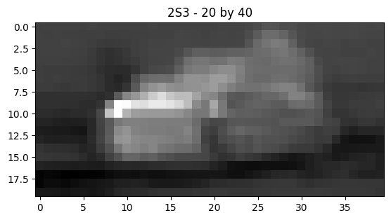
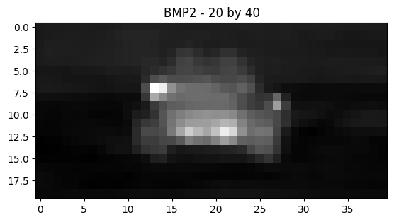
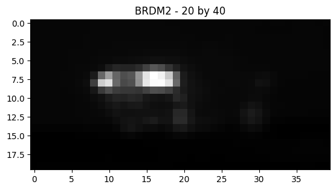
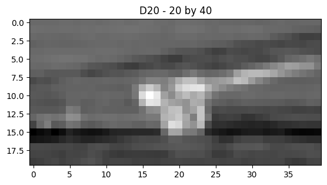
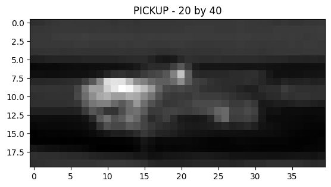
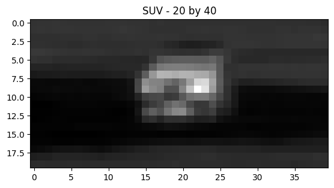
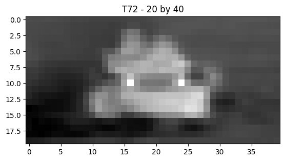
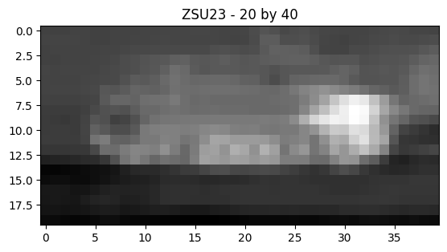

# Synthetic-ATR-Dataset_Eval:
Evaluate encoder-decoder network using ATR dataset

## Task:
1. Classify ground truth images (Print out classiification)
2. Create synthetic images using different orientation (Print out image), then classify synthetic image (Print out classification)
3. Find exact ground truth of different orientation, then classifiy ground truth of different orientation (Print out classifcation)
4. Evaluate:
    - How well the synthetic images are compared to the ground truth
    - Accuracy of classifcations

## Requirements:
- 9 Classifications:
    - PICKUP (#1)
    - SUV    (#2)
    - BTR70  (#5)
    - BRDM2  (#6)
    - BMP2   (#9)
    - T72    (#11)
    - ZSU23  (#12)
    - 2S3    (#13)
    - D20    (#14)
    NOTE: T62 (#10) or human class will not be use.
- 1 Sensor:
    - MWIR    (cegr)
- 5 degree offset
- 2 Ranges
    - 1000m (Day: 2003/Night: 1923)
    - 2000m (Day: 2007/Night: 1927)

## Prerequisite
1. Download ATR dataset.
2. Upload dataset in the INPUT/Dataset directory
3. Download listed libraries

## Libraries:
- sklearn
- matplotlib
- numpy
- glob
- PIL
- seaborn
- jtop
- pytorch
- pandas
- torchsummary
- torch
- torchvision
- json
- scipy

# Dataset:
## Dataset Provided
- ATR Dataset (1,800 images per class aka frames from video)
    - New-scaled-16-bit.zip (Only used: cegr1923, cegr1927, cegr2003, cegr2007)
- Vehicle driving in a circle ~ 2 times
- ~ 900 images for each rotation.
- ~ 0.4 degrees of seperation per image.
- Format: .mat files (16-bit)

## Training Dataset
- Classifier Model:
    - Selected 900 images per class for training (roughly 1 full rotation)
        - Frame: 901 - 1,800
    - 9 classes
    - 2 times of day
    - 2 ranges
    - 900 * 9 * 2 * 2 = 32,400 images

- Encoder-Decoder Model:
    - Selected 36^2 images per class for training (roughly 10 degree seperation)
        - Frame: 901 - 1,800
        - 360 degrees/10 degree of sep = 36 images per class
        - Skip every 25 files [1, 26, 51,...]
        - 36^2 = 1,296 images per class (Every permutation)
    - 9 classes
    - 2 times of day
    - 2 ranges
    - 1,296 * 9 * 2 * 2 = 46,656 images

## Testing Dataset
- Classifier Model:
    - Selected 36 images per class for testing (roughly 10 degree seperation)
        - Frame: 1-900
        - 360 degrees/10 degree of sep = 36 images per class
        - Skip every 25 files [1, 26, 51,...]
    - 9 classes
    - 2 times of day
    - 2 ranges
    - 36 * 9 * 2 * 2 = 1,296 images

- Encoder-Decoder Model:
    - Selected 36^2 images per class for testing (roughly 10 degree seperation)
        - Frame: 1-900
        - 360 degrees/10 degree of sep = 36 images per class
        - Skip every 25 files [1, 26, 51,...]
        - 36^2 = 1,296 images per class (Every permutation)
    - 9 classes
    - 2 times of day
    - 2 ranges
    - 1,296 * 9 * 2 * 2 = 46,656 images

## Sameple Images
### 2S3

###  BMP2

### BRDM2

### D20

### PICKUP

### SUV

### T72

### ZSU23

# Models:
## Classifier Model:
- VGG16 (not pretrained)
- Input: ONE 40 by 80 images (.mat file)
- Ouput: Classification accuracy

## Encoder Decoder Model
- 4 layered CNN model
- Input: TWO  40 by 80 image (.mat file)
    - First images is the original ground truth (GT)
    - Second image is the image we want to synthetically create (parse orientation, time of day, etc.)
- Output: Syntheic image

# Get Start Easily:
## Convert images to csv files:
    - py .\images2csv.py --train_classifier True --test_classifier True --train_encoder_decoder True --test_encoder_decoder True

## Train/Test Classifier Model
### NOTE: Change arguments as needed
- Train Classifier:
    - py .\train_classifier.py

- Test Classifier:
    - py .\test_classifier.py

## Train/Test Encoder Decoder Model
### NOTE: Change arguments as needed
- Train Encoder Decoder:
    - py .\train_encoder_decoder.py --params true --epoch 100  # params
    - py .\train_encoder_decoder.py --params false --epoch 200 # zero params

- Test Encoder Decoder:
    - py .\train_encoder_decoder.py

# Evalutaion:
- Manifold Representation (t-SNE)
- Accuracy
- Loss
- Training and Testing Time

# Folder Structure
- Helper_Functions/: Folder containing helper functions
    - az_dict.txt: Dict of azimuth to degrees translations
    - dataset.py: Class used to organize dataset for models
    - helper_test_classifier.py: Helper function for test_classifier.py
    - helper_test_encoder_decoder.py: Helper function for test_encoder_decoder.py
    - helper_train_classifier.py: Helper function for train_classifier.py
    - helper_train_encoder_decoder.py: Helper function for train_encoder_decoder.py
    - models.py: Class to create encoder decoder model
    - sample_image.py: Test function to sample a few images (TESTING PURPOSES)
    - test_classifier_images2csv.py: Helper functipm to convert dataset to csv used during classifier testing
    - test_encoder_decoder_images2csv.py: Helper functipm to convert dataset to csv used during encoder decoder testing
    - train_classifier_images2csv.py: Helper functipm to convert dataset to csv used during classifier training
    - train_encoder_decoder_images2csv.py: Helper functipm to convert dataset to csv used during encoder decoder training
- INPUT/: Folder containing input csv or input images
    - Dataset/: Folder containing dataset (Create folder and input images here) (To larger to push onto github repo)
        - cegr1923: Images at night at 1000m
        - cegr1927: Images at day at 1000m
        - cegr2003: Images at night at 2000m
        - cegr2007: Images at day at 2000m
    - Test_Classifier_Dataset.csv: CSV file created to use during classifier testing
    - Test_Encoder_Decoder_Dataset.csv: CSV file created to use during encoder decoder testing
    - Train_Classifier_Dataset.csv: CSV file created to use during classifier training
    - Train_Encoder_Decoder_Dataset.csv: CSV file created to use during encoder decoder training
- OUTPUT/: Folder contains output of each run
    - sample_images/: Sample of each class
    - test_classifier/
    - test_encoder_decoder/
    - train_classifier/
    - train_encoder_decoder/
- README.md: Readme file
- .gitignore: Ignore specific files
- images2csv.py: Convert dataset to csv used during training and testing
- test_classifier.py: Main function to evaluate classifer performance
- test_encoder_decoder.py: Main function to evaluate encoder decoder performance
- train_classifier.py: Main function to train classifier
- train_enoder_decoder.py: Main function to train encoder decoder

# Citation
- M. Arif and A. Mahalanobis, "Infrared Target Recognition Using Realistic Training Images Generated by Modifying Latent Features of an Encoder–Decoder Network," in IEEE Transactions on Aerospace and Electronic Systems, vol. 57, no. 6, pp. 4448-4456, Dec. 2021, doi: 10.1109/TAES.2021.3090921.
